# 📋 Checker Role & Feature Implementation

## 🎯 Overview

This document describes the comprehensive implementation of the **Checker Role** feature for the donation/case management system. The Checker role serves as an intermediate review layer between case submission (by families) and final approval for donor visibility.

## 🏗️ System Architecture

### Role Hierarchy
```
Admin
├── Manages all cases, users, and system settings
├── Can assign cases to checkers
└── Has full system access

Checker (NEW)
├── Reviews cases assigned by admin
├── Conducts field verification
├── Approves/rejects cases with detailed assessment
└── Cannot access admin functions

Family
├── Submits cases for assistance
└── Limited to own case management

Donor
├── Views approved cases only
└── Makes donations to verified cases
```

## 🔧 Backend Implementation

### 1. Enhanced Case Model (`backend/models/Case.js`)

**New Fields Added:**
- `auditLog` - Complete audit trail of all case actions
- Enhanced `checkerDecision` schema with field assessment data
- Audit methods for tracking user actions

**Key Features:**
```javascript
// Audit logging method
caseSchema.methods.addAuditLog = function(action, performedBy, performedByRole, details, notes, ipAddress)

// Audit retrieval methods
caseSchema.methods.getAuditLogByAction = function(action)
caseSchema.methods.getLatestAuditEntry = function()
```

### 2. Checker API Routes (`backend/routes/checker.js`)

**Endpoints:**
- `GET /api/checker/cases` - Get all cases for checker review
- `GET /api/checker/stats` - Get checker performance statistics
- `GET /api/checker/cases/:caseId` - Get detailed case information
- `POST /api/checker/cases/:caseId/assign-to-me` - Self-assign a case
- `POST /api/checker/cases/:caseId/decision` - Submit approval/rejection decision

**Authentication:** All routes protected with `auth` and `isChecker` middleware

### 3. Enhanced Authentication (`backend/middleware/auth.js`)

**New Middleware:**
- `isChecker` - Validates checker role access
- Enhanced role-based access control

## 🎨 Frontend Implementation

### 1. Checker Dashboard (`frontend/src/pages/dashboardChecker/`)

**Main Components:**
- `CheckerDashboard.jsx` - Main dashboard with dual view (cards/map)
- `CaseCard.jsx` - Individual case display component
- `CaseReviewModal.jsx` - Comprehensive case review interface
- `LebanonMap.jsx` - Interactive map with case locations
- `StatsOverview.jsx` - Performance metrics display
- `FilterControls.jsx` - Advanced filtering and search

**Key Features:**
- **Dual View Mode:** Toggle between card grid and interactive map
- **Advanced Filtering:** Status, village, priority, and text search
- **Real-time Statistics:** Dashboard metrics and performance tracking
- **Interactive Map:** Lebanon map with village-based case clustering
- **Comprehensive Review:** Multi-tab case review with full history

### 2. Case Review Modal

**Six-Tab Interface:**
1. **Overview** - Case summary and status information
2. **Family Details** - Complete family and contact information
3. **Damage Report** - Destruction details and assessment
4. **Documents** - Uploaded files with image preview
5. **History** - Complete audit trail with timeline
6. **Review** - Decision submission interface

**Review Capabilities:**
- **Case Assignment:** Self-assign unassigned cases
- **Approval Process:** 
  - Enter field-verified damage percentage
  - Set estimated rebuilding cost
  - Add comprehensive comments and field notes
- **Rejection Process:**
  - Provide detailed rejection reasons
  - Case automatically removed from donor visibility

### 3. Interactive Lebanon Map

**Features:**
- **Village Clustering:** Cases grouped by location
- **Color-Coded Markers:** Priority and status-based visualization
- **Size-Based Indicators:** Marker size reflects case count
- **Click Interactions:** Village popups with case summaries
- **Responsive Design:** Mobile-optimized map interface

**Map Legend:**
- 🔴 Red: High priority cases
- 🟡 Yellow: Pending review cases  
- 🟢 Green: Resolved/approved cases
- Size: Small (1-2), Medium (3-4), Large (5+ cases)

## 🔄 Workflow Implementation

### Case Lifecycle with Checker

```mermaid
graph TD
    A[Family Submits Case] --> B[Case: 'submitted']
    B --> C[Admin Assigns to Checker]
    C --> D[Case: 'under_review']
    D --> E{Checker Decision}
    E -->|Approve| F[Case: 'approved']
    E -->|Reject| G[Case: 'rejected' → Deleted]
    F --> H[Visible to Donors]
    F --> I[Donations Accepted]
    G --> J[Removed from System]
```



### Detailed Approval Process

1. **Case Assignment**
   - Admin assigns case to checker OR
   - Checker self-assigns available case

2. **Field Verification**
   - Checker conducts on-site assessment
   - Verifies damage claims and family situation
   - Documents findings in field notes

3. **Decision Submission**
   - **For Approval:**
     - Final damage percentage (field-verified)
     - Estimated rebuilding cost
     - Detailed comments and field notes
   - **For Rejection:**
     - Comprehensive rejection reasons
     - Case documentation for audit

4. **Post-Decision Actions**
   - **Approved cases:** Move to donor-visible pool
   - **Rejected cases:** Complete removal from system
   - **Audit logging:** All actions tracked with timestamps

## 📊 Statistics & Analytics

### Checker Performance Metrics

**Dashboard Stats:**
- Total cases assigned
- Pending reviews
- Approved cases
- Rejected cases
- Available unassigned cases
- Average review time

**System Analytics:**
- Case approval/rejection rates
- Average time from submission to decision
- Geographic distribution of cases
- Damage assessment trends

## 🛡️ Security & Access Control

### Authentication Flow
1. **Login Validation:** Checker credentials verified
2. **Role Verification:** Middleware confirms checker privileges
3. **Session Management:** Secure token-based authentication
4. **Route Protection:** All checker routes require authentication

### Data Protection
- **Audit Trails:** Complete action logging with user attribution
- **Role Isolation:** Checkers cannot access admin functions
- **Case Isolation:** Checkers only see assigned/available cases
- **Secure API:** All endpoints protected with proper validation

## 🚀 API Testing

### Test Script (`backend/test-checker-api.js`)

**Automated Testing:**
```bash
cd backend
node test-checker-api.js
```

**Test Coverage:**
- ✅ User authentication (register/login)
- ✅ Get checker cases
- ✅ Get checker statistics  
- ✅ Get individual case details
- ✅ Case self-assignment
- ✅ Decision submission (approval/rejection)

## 📱 Mobile Responsiveness

### Responsive Design Features
- **Mobile-First Approach:** Optimized for mobile devices
- **Touch-Friendly Interface:** Large buttons and touch targets
- **Collapsible Navigation:** Space-efficient mobile navigation
- **Responsive Grid:** Adaptive layout for all screen sizes
- **Mobile Map:** Touch-optimized map interactions

### Breakpoints
- **Desktop:** 1200px+ (Full feature set)
- **Tablet:** 768px-1199px (Optimized layout)
- **Mobile:** <768px (Mobile-first design)

## 🔧 Configuration & Setup

### Backend Setup
1. **Database Migration:** Case model automatically updated
2. **Route Registration:** Checker routes added to server.js
3. **Middleware Setup:** Authentication middleware configured
4. **Test Data:** Use test script for validation

### Frontend Setup
1. **Component Integration:** All components self-contained
2. **Routing:** Checker routes added to App.jsx
3. **Authentication:** Login redirection includes checker role
4. **API Integration:** Checker endpoints added to api.js

## 🎯 Key Benefits

### For System Efficiency
- **Quality Assurance:** Field verification before donor exposure
- **Fraud Prevention:** On-ground validation of case authenticity  
- **Resource Optimization:** Ensures funds go to genuine cases
- **Transparency:** Complete audit trail for accountability

### For User Experience
- **Visual Case Management:** Interactive dashboard with map
- **Streamlined Workflow:** Intuitive review process
- **Comprehensive Information:** All case data in one interface
- **Mobile Accessibility:** Full functionality on all devices

### For System Scalability
- **Role-Based Architecture:** Clear separation of concerns
- **Modular Design:** Components can be extended independently
- **API-First Approach:** Backend can support multiple frontends
- **Audit Infrastructure:** Foundation for advanced analytics

## 🔮 Future Enhancements

### Potential Improvements
1. **Real-time Notifications:** WebSocket integration for live updates
2. **Advanced Analytics:** Machine learning for case prioritization
3. **Mobile App:** Native mobile application for field workers
4. **Offline Capability:** Work without internet connection
5. **GPS Integration:** Automatic location verification
6. **Photo Evidence:** Enhanced image upload and verification
7. **Multi-language Support:** Arabic/English interface
8. **Export Capabilities:** PDF reports and data export

## 📞 Support & Documentation

### Resources
- **API Documentation:** Complete endpoint specifications
- **Component Documentation:** React component props and usage
- **Test Suite:** Comprehensive testing scripts
- **Error Handling:** Detailed error messages and recovery

### Contact
For technical support or feature requests, please refer to the development team documentation or create an issue in the project repository.

---

**Implementation Status:** ✅ Complete
**Last Updated:** December 2024
**Version:** 1.0.0
